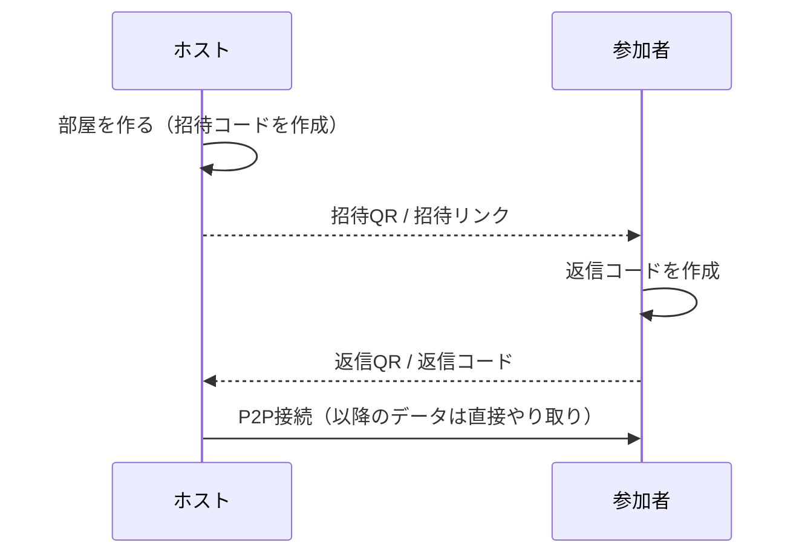

# P2P Chat

サーバを使わずに、スマホやPCのブラウザ同士を直接つないでチャットするデモアプリです。
テキスト、画像、ファイルを送れて、複数人で参加できます。

「サーバレスでゲームを作る」方法の1つとして、どう動くかを共有するために作りました。

**公開URL:** https://yamazakikouta.github.io/p2p-chat/


## 特徴

- **サーバ不要**：チャットの中身は端末間で直接やり取りします（WebRTC DataChannel）
- **暗号化**：通信はWebRTCの標準機能（DTLS）で暗号化されます
- **インストール不要**：ブラウザで開くだけで、iPhoneとAndroidとPCのどれでも使えます
- **QRコードで接続**：同じ場所にいる人は、QRを読み取り合うだけでつながります
- **離れた人とも接続**：接続コードをLINEやメールで送ればつながります
- **複数人で参加**：ホストが何人でも招待できます
- **画像・ファイル送信**：画像はチャット内に表示され、ファイルはダウンロードできます

## 使い方

### ホスト（部屋を作る人）

1. 公開URLを開き、表示名を入れて **「部屋を作る（ホスト）」** を押します
2. 招待QRコードが表示されるので、参加する人に読み取ってもらいます
   - 離れた場所の人には、「リンクで送る」から招待リンクをLINEなどで送ります
3. 相手の画面に返信コードのQRが出たら、**「QRを読み取る」** を押してカメラで読み取ります
   - 返信コードがLINEなどで届いた場合は、貼り付けて **「接続する」** を押します
4. つながるとチャット画面に切り替わります
5. さらに人を増やすときは、画面上部の **「＋ 招待」** から手順2〜3を繰り返します（1人ずつ招待します）

### 参加者

1. ホストの招待QRをスマホのカメラで読み取ります（または届いた招待リンクを開きます）
   - アプリ内の「招待を受けて参加」→「QRを読み取る」でも読み取れます
2. 返信コードのQRが表示されるので、ホストに読み取ってもらいます
   - 離れている場合は、「コードで送る」から返信コードをホストに送り返します
   - この画面で表示名を変えられます
3. ホストが読み取るとチャット画面に切り替わります

### 接続の流れ



## しくみ

### 接続（シグナリング）

WebRTCでは、最初に双方の接続情報（SDP / ICE候補）を交換する必要があり、通常はそこにサーバを使います。
このアプリでは、その情報をQRコードやテキストにして**人の手で受け渡す**ことで、サーバをなくしています。

- 接続情報は `deflate` で圧縮し、base64url にしています（約700文字）
- 自分のグローバルIPを調べるために、公開STUNサーバ（Google、Cloudflare）だけを使います。チャットのデータはここを通りません

### 複数人（スター型）

```
  参加者B ──┐
            ├── ホスト ── 参加者D
  参加者C ──┘
```

- 参加者はホストとだけつながり、ホストが他の参加者にメッセージを中継します
- ホストが抜けると、チャット全体が終わります
- 人数やファイルが増えるほど、ホストの端末と回線に負荷がかかります

### 送信データ

| 種類 | 形式 |
|---|---|
| テキスト・制御メッセージ | JSON文字列（`hello` / `welcome` / `members` / `sys` / `text` / `file` / `end`） |
| ファイル本体 | 16KBずつのバイナリ。先頭に `[ID長 1byte][ファイルID]` を付けて区別 |

## セキュリティ

このアプリはデモ用です。信頼できる知り合い同士で使うことを前提にしています。

### 守られるもの・守られないもの

| 項目 | 状態 | 補足 |
|---|---|---|
| 通信経路での盗聴 | 守られる | 各接続はDTLSで暗号化されます |
| サーバでの保存・閲覧 | 該当なし | チャットの中身を扱うサーバがありません |
| 参加者によるなりすまし | 守られる | ホストが送り主を確認して中継します |
| 参加者による偽のシステム表示 | 守られる | ホスト専用のメッセージは受け付けません |
| 悪意のあるファイルの自動実行 | 守られる | 画像以外はダウンロード専用です |
| ホストによる盗み見・改ざん | **守られない** | ホストは全員のメッセージを読めます |
| コードのすり替え（中間者攻撃） | **守られない** | 下の「中間者攻撃について」を参照してください |
| IPアドレスの秘匿 | **守られない** | 招待コードと返信コードに含まれます |
| 大量送信による妨害 | **守られない** | ホストの端末が重くなります |

### 対策済み

- **なりすまし防止**：参加者のIDはホストが割り当てます。ホストは中継するとき、送り主を実際の接続元で上書きします
- **ホスト専用メッセージの保護**：システムメッセージや参加者一覧は、参加者から送られてきても無視します
- **ファイルへの割り込み防止**：ファイルIDをホストが「送り主ID.元のID」に付け替えるので、他人のファイルにデータを混ぜられません。宣言サイズを超えたデータは捨てます（1ファイル最大200MB）
- **ファイルの安全な表示**：画像として表示するのは PNG、JPEG、GIF、WebP だけで、SVGなどそれ以外はダウンロード専用です
- **入力のチェック**：名前、本文、ファイル名は長さを制限し、すべてテキストとして表示します（HTMLとしては解釈しません）。壊れたデータは無視します
- **CDNの改ざん対策**：外部ライブラリは SRI（`integrity` 属性）付きで読み込みます

### しくみ上の注意

- **ホストは信頼できる人に**：暗号化されるのは端末とホストの間までです。ホストは全員のメッセージを読むことも書き換えることもできます
- **招待コードにはIPアドレスが含まれます**：LINEなどで送ると履歴に残ります。STUNサーバ（Google、Cloudflare）にもIPアドレスが伝わります
- **コードは信頼できる経路で渡してください**：招待コードと返信コードの両方を途中ですり替えられると、中間者攻撃が成り立ちます
- **妨害への耐性はありません**：大量のデータを送られると、ホストの端末が重くなります

### 中間者攻撃について

招待コードと返信コードには、それぞれの端末の暗号鍵の指紋（フィンガープリント）が含まれています。
攻撃者が途中で**両方のコード**を自分のものにすり替えると、次のようにつながります。

```
ホスト ⇄ 攻撃者 ⇄ 参加者
```

画面には「接続中」と表示されるので気づけず、攻撃者はすべてのメッセージを読むことも書き換えることもできます。

- **現実的なリスク**：対面でQRを読み取る場合や、LINEなど本人確認済みの経路でコードを送る場合は、すり替えはまず起こりません
- **未実装の対策**：接続後に双方の指紋から短い数字（例：`4827 1093`）を計算して両方の画面に表示し、見比べて一致を確認する「確認用の数字」の機能です。Signal の安全番号や、Bluetooth のペアリングの確認番号と同じ仕組みです。信頼できない経路でコードを受け渡す場合に必要になります

### 安全に使うために

- コードは対面のQR読み取りか、本人確認済みのメッセージアプリで受け渡してください
- 公開の掲示板やSNSに招待リンクを載せないでください。リンクを見た誰でも返信コードを作れるので、知らない人の返信コードを受け入れてしまうおそれがあります。また、IPアドレスも公開されます
- 知らない人から届いた返信コードは読み取らないでください
- 受け取ったファイルを開く前に、送り主と内容を確認してください
- 公開元のGitHubアカウントでは2段階認証を有効にしてください。アカウントを乗っ取られると、アプリ自体を書き換えられます

### 確認した攻撃

参加者の1人を攻撃役にして、データチャネルに直接次のデータを送り、すべて防げることを確認しました。

- ホストの名前を名乗ったメッセージ
- 偽のシステムメッセージと偽の参加者一覧
- `hello` を送り直しての別人への乗っ取り
- 他の参加者のファイルへのデータの割り込み
- スクリプト入りのSVGファイル
- 宣言サイズを超えるデータ
- 壊れたJSON

## 制限事項

- **つながらない組み合わせがあります**：モバイル回線同士や、企業・学校のネットワークでは直接つながらないことがあります。確実につなぐには中継サーバ（TURN）が必要で、これがサーバレスの限界です
- **オフラインの相手には届きません**：全員がアプリを開いている間だけやり取りできます。履歴も保存されません（ページを閉じると消えます）
- **バックグラウンドで切れます**：スマホで別のアプリに切り替えたり画面を消したりすると、接続が切れることがあります
- **再接続はできません**：切れた場合は、招待からやり直してください
- **カメラの利用にはHTTPSが必要です**：GitHub Pagesなら問題ありません

## ファイル構成

```
index.html   アプリ本体（HTML / CSS / JavaScript をすべて含む1ファイル）
qr.png       公開URLのQRコード
README.md    このファイル
```

外部ライブラリはCDNから読み込んでいます。

- [qrcode-generator](https://github.com/kazuhikoarase/qrcode-generator) 1.4.4：QRコードの表示
- [jsQR](https://github.com/cozmo/jsQR) 1.4.0：カメラ映像からのQR読み取り

## 手元で動かす

`index.html` を任意の静的サーバで配信するだけで動きます。

```bash
npx serve .
```

スマホのカメラでQRを読み取るにはHTTPSが必要です。スマホから試すときはGitHub Pagesなどに置いてください。

## 更新のしかた

`index.html` を編集して `main` ブランチにpushすると、1分ほどでGitHub Pagesに反映されます。

## ゲームに応用するには

- `broadcast(JSON.stringify({...}))` で送っている中身を、プレイヤーの操作やゲームの状態に置き換えます
- スター型なので、**ホストがゲームの状態を持つ（ホスト権威型）**設計にすると自然です。参加者は操作をホストに送り、ホストが結果を全員に配ります
