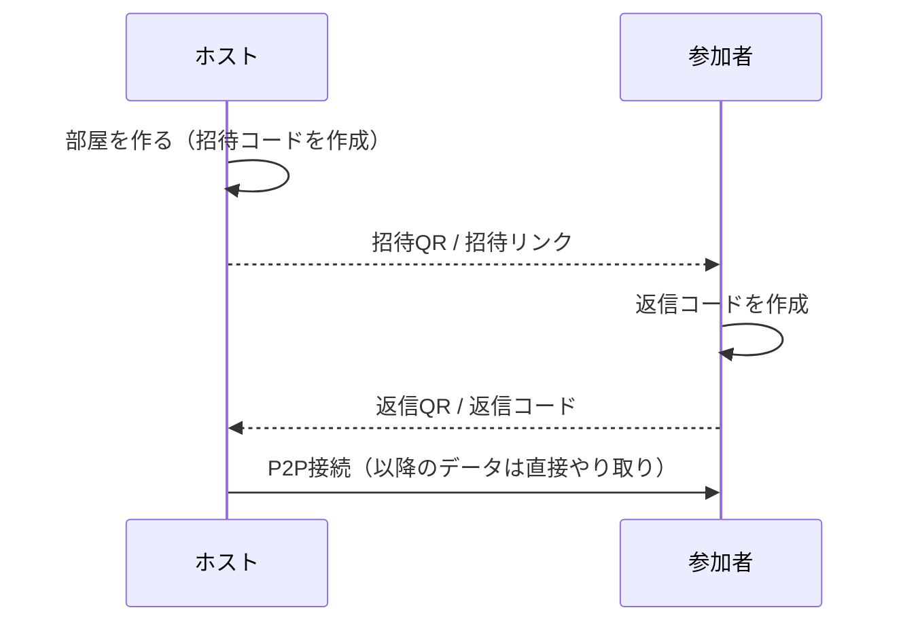

# P2P Chat

サーバを使わずに、スマホやPCのブラウザ同士を直接つないでチャットするデモアプリです。
テキスト、画像、ファイルを送れて、複数人で参加できます。

「サーバレスでゲームを作る」方法の1つとして、どう動くかを共有するために作りました。

**公開URL:** https://yamazakikouta.github.io/p2p-chat/


## 特徴

- **サーバ不要**：チャットの中身は端末間で直接やり取りします（WebRTC DataChannel）
- **暗号化**：通信はWebRTCの標準機能（DTLS）で暗号化されます
- **インストール不要**：ブラウザで開くだけで、iPhoneとAndroidとPCのどれでも使えます
- **QRコードで接続**：同じ場所にいる人は、QRを読み取り合うだけでつながります
- **離れた人とも接続**：接続コードをLINEやメールで送ればつながります
- **複数人で参加**：ホストが何人でも招待できます
- **画像・ファイル送信**：画像はチャット内に表示され、ファイルはダウンロードできます

## 使い方

### ホスト（部屋を作る人）

1. 公開URLを開き、表示名を入れて **「部屋を作る（ホスト）」** を押します
2. 招待QRコードが表示されるので、参加する人に読み取ってもらいます
   - 離れた場所の人には、「リンクで送る」から招待リンクをLINEなどで送ります
3. 相手の画面に返信コードのQRが出たら、**「QRを読み取る」** を押してカメラで読み取ります
   - 返信コードがLINEなどで届いた場合は、貼り付けて **「接続する」** を押します
4. つながるとチャット画面に切り替わります
5. さらに人を増やすときは、画面上部の **「＋ 招待」** から手順2〜3を繰り返します（1人ずつ招待します）

### 参加者

1. ホストの招待QRをスマホのカメラで読み取ります（または届いた招待リンクを開きます）
   - アプリ内の「招待を受けて参加」→「QRを読み取る」でも読み取れます
2. 返信コードのQRが表示されるので、ホストに読み取ってもらいます
   - 離れている場合は、「コードで送る」から返信コードをホストに送り返します
   - この画面で表示名を変えられます
3. ホストが読み取るとチャット画面に切り替わります

### 接続の流れ



## しくみ

### 接続（シグナリング）

WebRTCでは、最初に双方の接続情報（SDP / ICE候補）を交換する必要があり、通常はそこにサーバを使います。
このアプリでは、その情報をQRコードやテキストにして**人の手で受け渡す**ことで、サーバをなくしています。

- 接続情報は `deflate` で圧縮し、base64url にしています（約700文字）
- 自分のグローバルIPを調べるために、公開STUNサーバ（Google、Cloudflare）だけを使います。チャットのデータはここを通りません

### 複数人（スター型）

```
  参加者B ──┐
            ├── ホスト ── 参加者D
  参加者C ──┘
```

- 参加者はホストとだけつながり、ホストが他の参加者にメッセージを中継します
- ホストが抜けると、チャット全体が終わります
- 人数やファイルが増えるほど、ホストの端末と回線に負荷がかかります

### 送信データ

| 種類 | 形式 |
|---|---|
| テキスト・制御メッセージ | JSON文字列（`hello` / `members` / `sys` / `text` / `file` / `end`） |
| ファイル本体 | 16KBずつのバイナリ。先頭に `[ID長 1byte][ファイルID]` を付けて区別 |

## 制限事項

- **つながらない組み合わせがあります**：モバイル回線同士や、企業・学校のネットワークでは直接つながらないことがあります。確実につなぐには中継サーバ（TURN）が必要で、これがサーバレスの限界です
- **オフラインの相手には届きません**：全員がアプリを開いている間だけやり取りできます。履歴も保存されません（ページを閉じると消えます）
- **バックグラウンドで切れます**：スマホで別のアプリに切り替えたり画面を消したりすると、接続が切れることがあります
- **再接続はできません**：切れた場合は、招待からやり直してください
- **カメラの利用にはHTTPSが必要です**：GitHub Pagesなら問題ありません

## ファイル構成

```
index.html   アプリ本体（HTML / CSS / JavaScript をすべて含む1ファイル）
qr.png       公開URLのQRコード
README.md    このファイル
```

外部ライブラリはCDNから読み込んでいます。

- [qrcode-generator](https://github.com/kazuhikoarase/qrcode-generator) 1.4.4：QRコードの表示
- [jsQR](https://github.com/cozmo/jsQR) 1.4.0：カメラ映像からのQR読み取り

## 手元で動かす

`index.html` を任意の静的サーバで配信するだけで動きます。

```bash
npx serve .
```

スマホのカメラでQRを読み取るにはHTTPSが必要です。スマホから試すときはGitHub Pagesなどに置いてください。

## 更新のしかた

`index.html` を編集して `main` ブランチにpushすると、1分ほどでGitHub Pagesに反映されます。

## ゲームに応用するには

- `broadcast(JSON.stringify({...}))` で送っている中身を、プレイヤーの操作やゲームの状態に置き換えます
- スター型なので、**ホストがゲームの状態を持つ（ホスト権威型）**設計にすると自然です。参加者は操作をホストに送り、ホストが結果を全員に配ります
